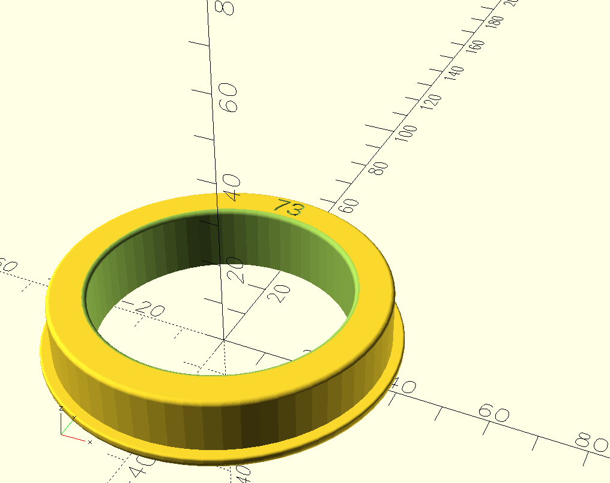
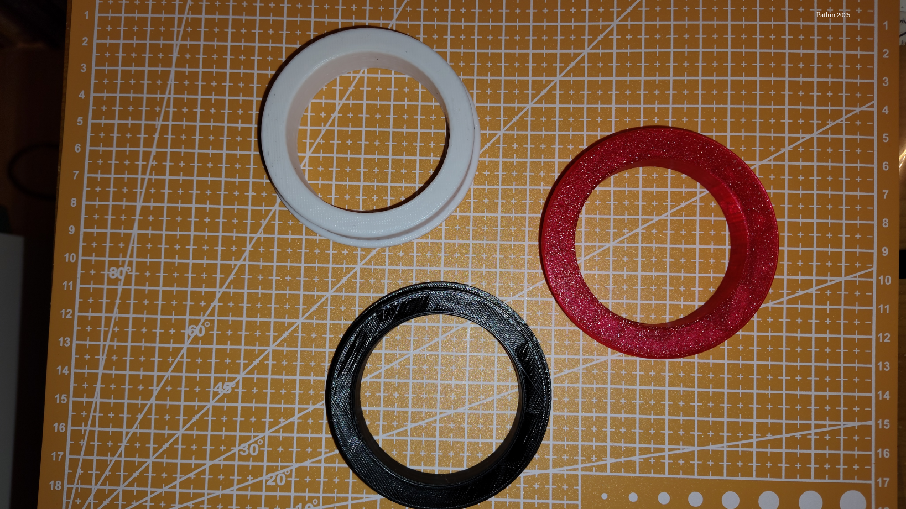
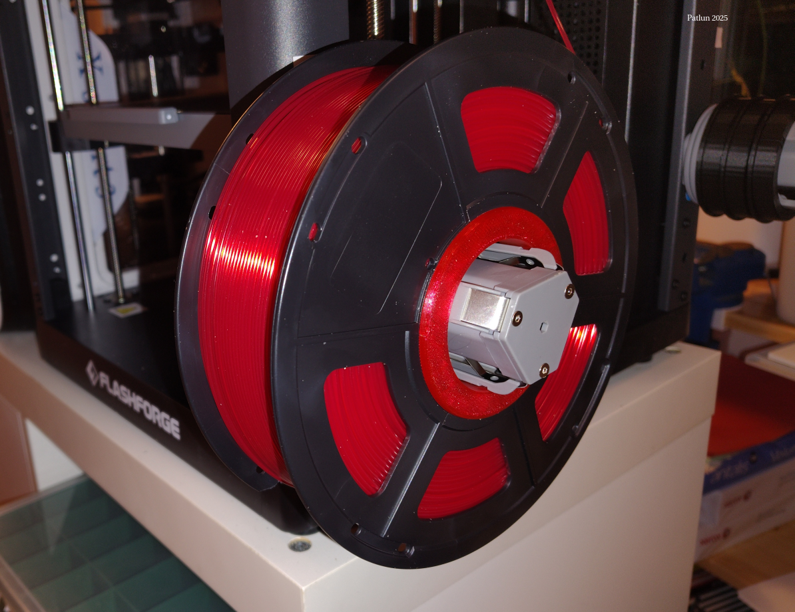

# Adapter large hole (73 mm) spools to Flashforge AD5X spool holders.

## Description
When putting my standard filament from Jayo / Sunlu on the AD5X I get problems as the spool holder is about 56 mm while the Jayo spools are somewhere between 71 and 75 mm. I created a simple adapter to solve that problem. After I started use my adapter I found out that there are lots of adapters out there, I suppose the world need one more. My variant uses about 13g filament and takes 13:30 minutes in my Creality K1C, and about 20 minutes in the AD5X that I have not finish tuning yet.

I have attached stl-files for 72, 72.5, 73, 73.5 and 74 mm holes below. The provided openscad file can be used for other diameters, either by editing the file direct or by using the Customizer in openscad. This project is dependent on the [BOSL2](https://github.com/BelfrySCAD/BOSL2/wiki) library

## Usage
Measure your spool and print one holder for each side, I have found that the spools often (always?) have different diameters on the two sides. 

## Slicer settings
I don't believe you need any specific settings, I used the ones below 
**Filament:** PLA (orca generic settings)
**Nozzle:** 0.4 mm
**Line height:** 0.3 mm **Line width:** 0.6mm
**Walls:** 2 **Bottom layers:** 2 **Top layers:** 2
**Infill:**  8% tri-hexagon/gyroid

## Where to find it
- [**Github**](https://github.com/patlun/Flashforge-AD5X-spool-adapter)
- [**Printables.com**](https://www.printables.com/model/1416539-adapter-large-hole-73-mm-spools-to-flashforge-ad5x)

Shield: [![CC BY 4.0][cc-by-shield]][cc-by]

This work is licensed under a
[Creative Commons Attribution 4.0 International License][cc-by].

[![CC BY 4.0][cc-by-image]][cc-by]

[cc-by]: http://creativecommons.org/licenses/by/4.0/
[cc-by-image]: https://i.creativecommons.org/l/by/4.0/88x31.png
[cc-by-shield]: https://img.shields.io/badge/License-CC%20BY%204.0-lightgrey.svg